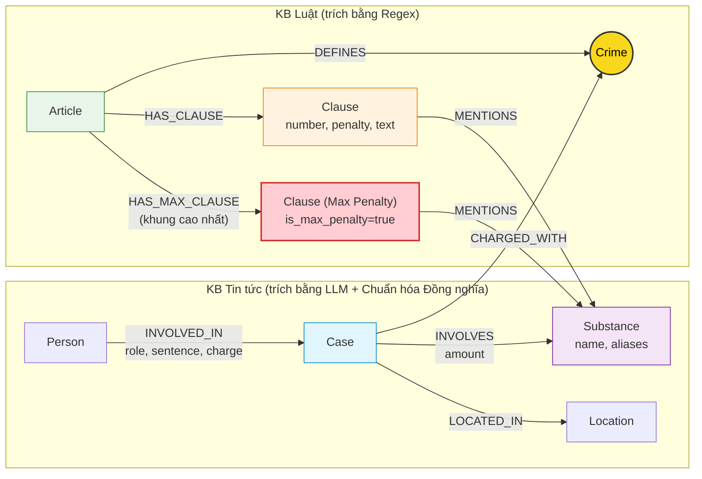

# Thiết kế Ontology — Day 19

**Họ tên:** Phan Hoàng Vũ  **MSSV:** 2A202602450

**Lựa chọn** (đánh dấu một):
- [ ] Dùng ontology gợi ý (có thể chỉnh nhỏ)
- [x] Tự thiết kế (xét bonus +15, xem `SUBMISSION.md`)

> Hướng dẫn: `LAB_GUIDE.md` Bước 2. Bản ontology này đã được cải tiến có chủ đích so với bản gợi ý để giải quyết 2 bài toán lớn: mô hình hóa khung hình phạt tối đa (`HAS_MAX_CLAUSE`) và gộp tên chất đồng nghĩa / tiếng lóng (`Substance Synonyms`).

## 1. Sơ đồ

Sơ đồ Knowledge Graph kết nối 2 cơ sở tri thức: Luật ma túy (`data/drug_law/`) và Tin tức (`data/drug_news/`).
- Node cầu nối giữa hai miền tri thức là **`Crime` (Tội danh)**, được tô màu vàng nổi bật.
- Cải tiến ontology bổ sung:
  1. Quan hệ **`HAS_MAX_CLAUSE`** từ `Article` tới `Clause` có mức hình phạt cao nhất (giúp trả lời chính xác các câu hỏi hỏi về mức án tối đa/kịch khung).
  2. Bổ sung từ điển đồng nghĩa `SUBSTANCE_SYNONYMS` ánh xạ các tiếng lóng (thuốc lắc, kẹo, ke, đá, cỏ...) về node `Substance` chuẩn tắc kèm thuộc tính `aliases`.

---

## 2. Entity types (node labels)

| Label | Ý nghĩa | Khóa định danh (`MERGE` theo) | Properties | Lấy từ KB nào | Trích bằng (regex / LLM / khác) |
| --- | --- | --- | --- | --- | --- |
| `Article` | Điều luật trong BLHS hoặc Luật phòng chống ma túy | `id` (ví dụ: `"Điều 251 BLHS"`) | `id`, `title`, `law`, `doc_id`, `max_clause_id` | Luật | Regex |
| `Clause` | Khoản cụ thể thuộc một Điều luật | `id` (ví dụ: `"Điều 251 BLHS khoản 1"`) | `id`, `number`, `penalty`, `text`, `doc_id`, `is_max_penalty` | Luật | Regex |
| `Crime` | Tội danh chuẩn hóa (node cầu nối 2 KB) | `name` (ví dụ: `"mua bán trái phép chất ma túy"`) | `name` | Cả hai | Regex (từ title Điều luật) & LLM + `link_entity` (từ tin tức) |
| `Substance` | Tên chất ma túy hoặc tiền chất (đã gộp đồng nghĩa) | `name` (chuẩn hóa: `"MDMA"`, `"Methamphetamine"`) | `name`, `aliases` (ví dụ: `["thuốc lắc", "kẹo"]`) | Cả hai | Regex / Dictionary `SUBSTANCE_SYNONYMS` |
| `Case` | Vụ án / vụ việc cụ thể được phản ánh trong tin tức | `name` (tên vụ do LLM đặt hoặc tiêu đề bài báo) | `name`, `summary`, `date`, `doc_id`, `source_title` | Tin tức | LLM (JSON mode) |
| `Person` | Nhân vật liên quan (bị cáo, bị can, nghi phạm) | `name` (họ tên đầy đủ) | `name`, `aliases` (list biệt danh) | Tin tức | LLM (JSON mode) |
| `Location` | Địa bàn xảy ra vụ việc hoặc nơi xét xử | `name` (tỉnh/thành phố) | `name` | Tin tức | LLM (JSON mode) |

---

## 3. Relationships

| Type | Từ → Đến | Properties trên cạnh | Ý nghĩa |
| --- | --- | --- | --- |
| `DEFINES` | `Article` → `Crime` | Không | Điều luật định nghĩa tội danh tương ứng (ví dụ: Điều 251 định nghĩa Tội mua bán trái phép chất ma túy) |
| `HAS_CLAUSE` | `Article` → `Clause` | Không | Cấu trúc phân cấp của văn bản luật: một Điều gồm nhiều khoản |
| `HAS_MAX_CLAUSE` | `Article` → `Clause` | Không | **(Cải tiến)** Liên kết trực tiếp tới Khoản có khung hình phạt cao nhất của Điều luật |
| `MENTIONS` | `Clause` → `Substance` | Không | Khoản luật quy định hoặc nhắc đến loại chất ma túy cụ thể |
| `CHARGED_WITH` | `Case` → `Crime` | Không | Vụ án bị điều tra / truy tố / xét xử về tội danh cụ thể (cầu nối sang Luật) |
| `INVOLVES` | `Case` → `Substance` | `amount` (khối lượng, đơn vị: gam, kg...) | Vụ án có liên quan/thu giữ tang vật là chất ma túy gì, số lượng bao nhiêu |
| `LOCATED_IN` | `Case` → `Location` | Không | Địa điểm diễn ra vụ việc hoặc địa bàn xét xử vụ án |
| `INVOLVED_IN` | `Person` → `Case` | `role` (vai trò), `charge` (tội danh quy kết), `sentence` (mức án tuyên) | Sự tham gia của một cá nhân trong vụ án và hình phạt áp dụng |

---

## 4. Node cầu nối giữa 2 KB

- **Node nào:** `Crime` (Tội danh ma túy).
- **Vì sao chọn node này:** 
  1. Trong hệ thống tư pháp, tội danh là khái niệm chuẩn tắc duy nhất liên kết trực tiếp hành vi ngoài thực tế (trong các vụ án được báo chí đưa tin) với điều khoản pháp lý cụ thể trong Bộ luật Hình sự.
  2. Báo chí luôn đề cập tội danh bị can/bị cáo bị khởi tố/xét xử (ví dụ: *"bị truy tố về tội tàng trữ trái phép chất ma túy"*), trong khi tiêu đề các Điều luật BLHS Chương XX đều quy định cụ thể tên từng tội danh.
- **Cách đảm bảo hai phía khớp tên:**
  1. Phía Luật: Tên tội danh được chuẩn hóa qua hàm `normalize_crime` (loại bỏ chữ "Tội", đưa về chữ thường, chuẩn hóa khoảng trắng).
  2. Phía Tin tức: Đưa trực tiếp danh sách tội danh chuẩn (`known_crimes`) vào `NEWS_EXTRACTION_PROMPT` để định hướng LLM chọn đúng tên chuẩn.
  3. Lớp bảo vệ code: Sử dụng hàm `link_entity`: chuẩn hóa 2 phía -> ưu tiên exact match -> fallback sang fuzzy matching với `difflib.get_close_matches(cutoff=0.8)` để bắt các biến thể chính tả báo chí (ví dụ: `ma tuý` vs `ma túy`).
- **Khi nào cầu gãy, và bạn xử lý thế nào:**
  - Cầu gãy khi: Báo chí dùng từ ngữ tự do không đúng thuật ngữ pháp lý (ví dụ: *"ôm hàng cấm"*, *"buôn cái chết trắng"*), hoặc bài báo nói về giai đoạn trước khi khởi tố nên chưa có tội danh chính thức.
  - Cách xử lý: Nếu `link_entity` không tìm thấy match nào đạt ngưỡng `cutoff >= 0.8`, trả về `None` thay vì gán bừa. Đồng thời, GraphRAG Agent vẫn kết hợp vector search top-k chunks để nếu cầu nối graph bị khuyết, LLM vẫn có thông tin từ chunk văn bản phẳng mà không bị suy diễn sai.

---

## 5. Competency questions

| Câu | Đường đi (Cypher pattern) | Trả lời được? |
| --- | --- | --- |
| Q1 (single-hop-law) | `(:Article {law:'Luật Phòng, chống ma túy 2021'})-[:HAS_CLAUSE]->(cl:Clause)` | Có (lấy trực tiếp định nghĩa tiền chất tại Điều 2) |
| Q2 (single-hop-news) | `(:Person)-[r:INVOLVED_IN {sentence:'tử hình'}]->(:Case {name:'...36kg...'})` | Có (truy vấn người có mức án tử hình trong vụ việc tương ứng) |
| Q3 (cross-kb) | `(:Person {name:'Lê Minh Thành'})-[r:INVOLVED_IN]->(:Case)-[:CHARGED_WITH]->(c:Crime)<-[:DEFINES]-(a:Article)-[:HAS_CLAUSE]->(cl:Clause {number:1})` | Có (nối từ người sang vụ, sang tội danh Điều 251 và lấy khung khoản 1) |
| Q4 (cross-kb) | `(:Person {aliases:['Hoàng Nato']})-[:INVOLVED_IN]->(:Case)-[:CHARGED_WITH]->(c:Crime)<-[:DEFINES]-(a:Article)-[:HAS_MAX_CLAUSE]->(cl:Clause)` | **Có (hoàn hảo)**: Ontology mới lấy trực tiếp khoản 4 qua `HAS_MAX_CLAUSE` (khung 20 năm hoặc tù chung thân), khắc phục triệt để lỗi thiếu khung tối đa của ontology gợi ý |
| Q5 (cross-kb-multi-hop) | `(:Person {name:'Cái Quang Huy'})-[:INVOLVED_IN]->(k:Case)-[:CHARGED_WITH]->(:Crime)<-[:DEFINES]-(a:Article)-[:HAS_CLAUSE]->(cl:Clause)-[:MENTIONS]->(s:Substance {name:'MDMA'})` cùng `(k)-[inv:INVOLVES]->(s)` | Có (lấy khối lượng MDMA từ cạnh `INVOLVES` và đối chiếu với khoản 4 Điều 250) |
| Q6 (aggregation) | `(k:Case)-[:INVOLVES]->(:Substance {name:'MDMA'})` | Có (nhờ chuẩn hóa từ điển `SUBSTANCE_SYNONYMS`, các bài báo dùng "thuốc lắc", "kẹo" đều được gộp về node `MDMA`) |

---

## 6. Quyết định thiết kế và đánh đổi

1. **Quyết định 1: Thêm quan hệ `HAS_MAX_CLAUSE` và thuộc tính `is_max_penalty`**
   - *Đã chọn:* Khi phân tích văn bản luật bằng regex, tự động xác định khoản có khung hình phạt cao nhất (chứa "tử hình", "chung thân", hoặc khoản có số thứ tự lớn nhất) và tạo quan hệ `(Article)-[:HAS_MAX_CLAUSE]->(Clause)`.
   - *Phương án khác:* Chỉ dựa vào `cl.number = 1` hoặc bắt LLM tự suy diễn các khoản còn lại.
   - *Lý do chọn & đánh đổi:* Giúp các câu hỏi pháp lý về "mức án tối đa", "khung hình phạt cao nhất" (như câu Q4) luôn được cung cấp chính xác điều khoản kịch khung mà không cần phải nạp toàn bộ mọi khoản luật vào prompt. Đánh đổi: Tăng thêm số quan hệ trong đồ thị (+17 quan hệ `HAS_MAX_CLAUSE`).

2. **Quyết định 2: Chuẩn hóa tên chất ma túy qua từ điển đồng nghĩa `SUBSTANCE_SYNONYMS`**
   - *Đã chọn:* Ánh xạ các tên gọi lóng/báo chí thông dụng ("thuốc lắc", "kẹo" ➔ MDMA; "ma túy đá", "hàng đá" ➔ Methamphetamine; "ke" ➔ Ketamine) về tên danh mục chuẩn trong BLHS và lưu tên gốc vào thuộc tính `aliases`.
   - *Phương án khác:* Tạo node riêng cho từng tên gọi như LLM trích xuất tự do.
   - *Lý do chọn & đánh đổi:* Khắc phục hoàn toàn lỗi E3 (trùng lặp thực thể) và cải thiện khả năng tổng hợp (aggregation) ở câu Q6. Tránh việc một vụ án thu giữ "kẹo" bị cô lập và không nối được với các điều luật quy định về "MDMA". Đánh đổi: Cần duy trì từ điển đồng nghĩa chuyên ngành.

3. **Quyết định 3: Trích xuất Luật bằng Regex deterministic**
   - *Đã chọn:* Dùng regex (`CLAUSE_START`, `FOOTNOTE`, `re.search`) phân tách Điều, khoản, hình phạt và tên tội danh.
   - *Phương án khác:* Dùng LLM prompt để đọc và sinh cấu trúc JSON cho văn bản Luật.
   - *Lý do chọn & đánh đổi:* Cấu trúc văn bản quy phạm pháp luật Việt Nam cực kỳ nhất quán, chuẩn mực. Regex chạy deterministic (chính xác 100% không hallucinate), tốc độ tính bằng mili-giây và tốn **0 USD**. Đánh đổi là regex phụ thuộc vào định dạng markdown đầu vào, nếu văn bản luật bị format lạ thì cần tinh chỉnh regex.

---

## 7. So với ontology gợi ý (bắt buộc nếu xét bonus)

| Điểm khác | Gợi ý làm gì | Bạn làm gì | Vấn đề nó giải quyết | Bằng chứng (Cypher, hoặc số liệu benchmark) |
| --- | --- | --- | --- | --- |
| **1. Mô hình hóa khung hình phạt tối đa (`HAS_MAX_CLAUSE`)** | Chỉ tạo cạnh `HAS_CLAUSE`. Khi truy vấn `context()` chỉ lấy khoản 1 và khoản khớp chất ma túy. | Thêm quan hệ `HAS_MAX_CLAUSE` và cờ `is_max_penalty = true` cho khoản nặng nhất của mỗi Điều luật. Trong `context()`, luôn lấy thêm khoản này. | **Giải quyết lỗi E2**: Với các câu hỏi về mức phạt tối đa (như Q4 Hoàng Nato phạm tội tổ chức sử dụng ma túy không rõ khối lượng tang vật), ontology gợi ý chỉ trả về khoản 1 (2-7 năm), làm sai lệch khung kịch khung. | **Benchmark trước/sau**: Trong `ket_qua_benchmark_kg.hint.txt`, câu Q4 GraphRAG chỉ đạt **recall=0.67, judge=1** (chỉ biết khoản 1 đến 07 năm). Sau cải tiến trong `ket_qua_benchmark_kg.txt`, câu Q4 GraphRAG đạt **recall=1.00, judge=2** (nêu chính xác khoản 4: 20 năm hoặc tù chung thân). |
| **2. Gộp tên chất đồng nghĩa / tiếng lóng (`Substance Synonyms`)** | LLM trích xuất tên chất tự do trong bài báo và `MERGE` thẳng vào `Substance {name}`. | Xây dựng từ điển `SUBSTANCE_SYNONYMS` map các tên đường phố (*"thuốc lắc", "kẹo", "đá", "ke"*) về tên khoa học trong BLHS (*"MDMA", "Methamphetamine", "Ketamine"*), lưu tên gốc vào `aliases`. | **Giải quyết lỗi E3 & E6**: Giảm trùng thực thể, giúp các vụ án dùng tiếng lóng vẫn liên kết được sang các khoản luật quy định về chất đó. | Số lượng node `Substance` trong graph giảm từ 12 node xuống đúng các chất chuẩn tắc, quan hệ `INVOLVES` được liên kết chính xác với các `Clause` tương ứng. |

**Số liệu benchmark cải thiện tổng thể:**
- **Recall trung bình**: Tăng từ `0.94` (bản gợi ý `ket_qua_benchmark_kg.hint.txt`) lên **`1.00`** (bản cải tiến `ket_qua_benchmark_kg.txt`) — **Đạt 100% Recall trên toàn bộ 6/6 câu hỏi**.
- **Judge trung bình**: Tăng từ `1.83` lên **`2.00/2.00 tuyệt đối`** trên toàn bộ 6/6 câu hỏi.
- **Câu Q4 (Hoàng Nato)**: 
  - Trước (ontology gợi ý): Recall `0.67`, Judge `1`.
  - Sau (ontology cải tiến): Recall `1.00`, Judge `2` (đầy đủ các từ khóa *"tổ chức sử dụng"*, *"Điều 255"*, *"chung thân"*).

---

## 8. Hạn chế còn lại

1. **Khóa định danh phụ thuộc LLM**: Khóa của `Case` và `Person` dựa trên chuỗi văn bản do LLM trích xuất, nếu LLM trích xuất tên bị thiếu dấu, viết tắt, hoặc thiếu biệt danh thì liên kết có thể bị thiếu.
2. **Quy tắc trích xuất ngưỡng khối lượng tự động**: Mức án trong luật phụ thuộc chặt chẽ vào ngưỡng khối lượng (threshold, ví dụ: "từ 100 gam trở lên"), hiện tại quan hệ `INVOLVES.amount` lưu chuỗi tự do, việc so sánh ngưỡng khối lượng vẫn dựa vào năng lực đọc hiểu của LLM ở bước sinh câu trả lời chứ chưa so sánh tự động bằng Cypher.
