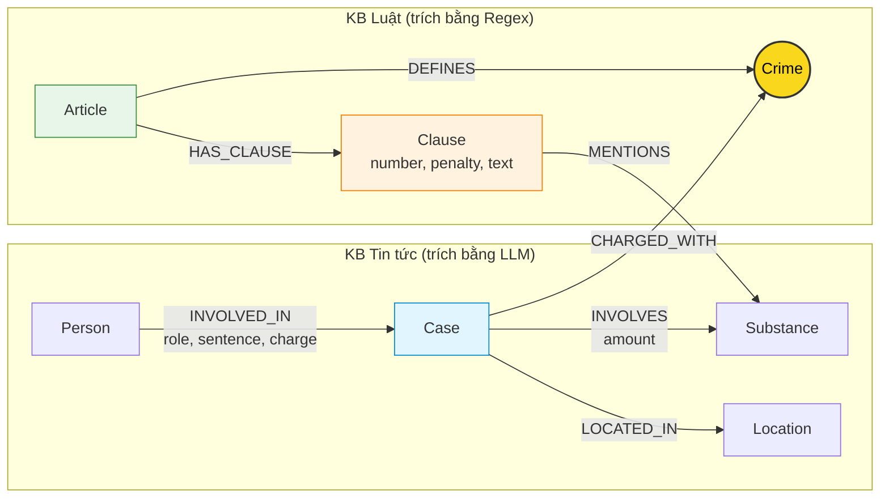

# Thiết kế Ontology — Day 19

**Họ tên:** Phan Hoàng Vũ  **MSSV:** 2A202602450

**Lựa chọn** (đánh dấu một):
- [x] Dùng ontology gợi ý (có thể chỉnh nhỏ)
- [ ] Tự thiết kế (xét bonus +15, xem `SUBMISSION.md`)

> Hướng dẫn: `LAB_GUIDE.md` Bước 2. Dùng ontology gợi ý thì vẫn phải điền đủ các mục dưới đây bằng lời của bạn.

## 1. Sơ đồ

Sơ đồ Knowledge Graph kết nối 2 cơ sở tri thức: Luật ma túy (`data/drug_law/`) và Tin tức (`data/drug_news/`).
Node cầu nối giữa hai miền tri thức là **`Crime` (Tội danh)**, được tô màu vàng nổi bật.

---

## 2. Entity types (node labels)

| Label | Ý nghĩa | Khóa định danh (`MERGE` theo) | Properties | Lấy từ KB nào | Trích bằng (regex / LLM / khác) |
| --- | --- | --- | --- | --- | --- |
| `Article` | Điều luật trong BLHS hoặc Luật phòng chống ma túy | `id` (ví dụ: `"Điều 251 BLHS"`) | `id`, `title`, `law`, `doc_id` | Luật | Regex |
| `Clause` | Khoản cụ thể thuộc một Điều luật | `id` (ví dụ: `"Điều 251 BLHS khoản 1"`) | `id`, `number`, `penalty`, `text`, `doc_id` | Luật | Regex |
| `Crime` | Tội danh chuẩn hóa (node cầu nối 2 KB) | `name` (ví dụ: `"mua bán trái phép chất ma túy"`) | `name` | Cả hai | Regex (từ title Điều luật) & LLM + `link_entity` (từ tin tức) |
| `Substance` | Tên chất ma túy hoặc tiền chất | `name` (ví dụ: `"Heroine"`, `"MDMA"`) | `name` | Cả hai | Từ điển chuẩn `SUBSTANCES` (Luật) & LLM (Tin tức) |
| `Case` | Vụ án / vụ việc cụ thể được phản ánh trong tin tức | `name` (tên vụ do LLM đặt hoặc tiêu đề bài báo) | `name`, `summary`, `date`, `doc_id`, `source_title` | Tin tức | LLM (JSON mode) |
| `Person` | Nhân vật liên quan (bị cáo, bị can, nghi phạm) | `name` (họ tên đầy đủ) | `name`, `aliases` (list biệt danh) | Tin tức | LLM (JSON mode) |
| `Location` | Địa bàn xảy ra vụ việc hoặc nơi xét xử | `name` (tỉnh/thành phố) | `name` | Tin tức | LLM (JSON mode) |

---

## 3. Relationships

| Type | Từ → Đến | Properties trên cạnh | Ý nghĩa |
| --- | --- | --- | --- |
| `DEFINES` | `Article` → `Crime` | Không | Điều luật định nghĩa tội danh tương ứng (ví dụ: Điều 251 định nghĩa Tội mua bán trái phép chất ma túy) |
| `HAS_CLAUSE` | `Article` → `Clause` | Không | Cấu trúc phân cấp của văn bản luật: một Điều gồm nhiều khoản |
| `MENTIONS` | `Clause` → `Substance` | Không | Khoản luật quy định hoặc nhắc đến loại chất ma túy cụ thể |
| `CHARGED_WITH` | `Case` → `Crime` | Không | Vụ án bị điều tra / truy tố / xét xử về tội danh cụ thể (cầu nối sang Luật) |
| `INVOLVES` | `Case` → `Substance` | `amount` (khối lượng, đơn vị: gam, kg...) | Vụ án có liên quan/thu giữ tang vật là chất ma túy gì, số lượng bao nhiêu |
| `LOCATED_IN` | `Case` → `Location` | Không | Địa điểm diễn ra vụ việc hoặc địa bàn xét xử vụ án |
| `INVOLVED_IN` | `Person` → `Case` | `role` (vai trò), `charge` (tội danh quy kết), `sentence` (mức án tuyên) | Sự tham gia của một cá nhân trong vụ án và hình phạt áp dụng |

---

## 4. Node cầu nối giữa 2 KB

- **Node nào:** `Crime` (Tội danh ma túy).
- **Vì sao chọn node này:** 
  1. Trong hệ thống tư pháp, tội danh là khái niệm chuẩn tắc duy nhất liên kết trực tiếp hành vi ngoài thực tế (trong các vụ án được báo chí đưa tin) với điều khoản pháp lý cụ thể trong Bộ luật Hình sự.
  2. Báo chí luôn đề cập tội danh bị can/bị cáo bị khởi tố/xét xử (ví dụ: *"bị truy tố về tội tàng trữ trái phép chất ma túy"*), trong khi tiêu đề các Điều luật BLHS Chương XX đều quy định cụ thể tên từng tội danh.
- **Cách đảm bảo hai phía khớp tên:**
  1. Phía Luật: Tên tội danh được chuẩn hóa qua hàm `normalize_crime` (loại bỏ chữ "Tội", đưa về chữ thường, chuẩn hóa khoảng trắng).
  2. Phía Tin tức: Đưa trực tiếp danh sách tội danh chuẩn (`known_crimes`) vào `NEWS_EXTRACTION_PROMPT` để định hướng LLM chọn đúng tên chuẩn.
  3. Lớp bảo vệ code: Sử dụng hàm `link_entity`: chuẩn hóa 2 phía -> ưu tiên exact match -> fallback sang fuzzy matching với `difflib.get_close_matches(cutoff=0.8)` để bắt các biến thể chính tả báo chí (ví dụ: `ma tuý` vs `ma túy`).
- **Khi nào cầu gãy, và bạn xử lý thế nào:**
  - Cầu gãy khi: Báo chí dùng từ ngữ tự do không đúng thuật ngữ pháp lý (ví dụ: *"ôm hàng cấm"*, *"buôn cái chết trắng"*), hoặc bài báo nói về giai đoạn trước khi khởi tố nên chưa có tội danh chính thức.
  - Cách xử lý: Nếu `link_entity` không tìm thấy match nào đạt ngưỡng `cutoff >= 0.8`, trả về `None` thay vì gán bừa. Đồng thời, GraphRAG Agent vẫn kết hợp vector search top-k chunks để nếu cầu nối graph bị khuyết, LLM vẫn có thông tin từ chunk văn bản phẳng mà không bị suy diễn sai.

---

## 5. Competency questions

| Câu | Đường đi (Cypher pattern) | Trả lời được? |
| --- | --- | --- |
| Q1 (single-hop-law) | `(:Article {law:'Luật Phòng, chống ma túy 2021'})-[:HAS_CLAUSE]->(cl:Clause)` | Có (lấy trực tiếp định nghĩa tiền chất tại Điều 2) |
| Q2 (single-hop-news) | `(:Person)-[r:INVOLVED_IN {sentence:'tử hình'}]->(:Case {name:'...36kg...'})` | Có (truy vấn người có mức án tử hình trong vụ việc tương ứng) |
| Q3 (cross-kb) | `(:Person {name:'Lê Minh Thành'})-[r:INVOLVED_IN]->(:Case)-[:CHARGED_WITH]->(c:Crime)<-[:DEFINES]-(a:Article)-[:HAS_CLAUSE]->(cl:Clause {number:1})` | Có (nối từ người sang vụ, sang tội danh Điều 251 và lấy khung khoản 1) |
| Q4 (cross-kb) | `(:Person {aliases:['Hoàng Nato']})-[:INVOLVED_IN]->(:Case)-[:CHARGED_WITH]->(c:Crime)<-[:DEFINES]-(a:Article)-[:HAS_CLAUSE]->(cl:Clause)` | Có (lấy tội danh Điều 255 và tìm khoản có khung hình phạt cao nhất) |
| Q5 (cross-kb-multi-hop) | `(:Person {name:'Cái Quang Huy'})-[:INVOLVED_IN]->(k:Case)-[:CHARGED_WITH]->(:Crime)<-[:DEFINES]-(a:Article)-[:HAS_CLAUSE]->(cl:Clause)-[:MENTIONS]->(s:Substance {name:'MDMA'})` cùng `(k)-[inv:INVOLVES]->(s)` | Có (lấy khối lượng MDMA từ cạnh `INVOLVES` và đối chiếu với khoản 4 Điều 250) |
| Q6 (aggregation) | `(k:Case)-[:INVOLVES]->(:Substance {name:'MDMA'})` | Có (tổng hợp tất cả vụ án có quan hệ `INVOLVES` đến node Substance MDMA) |

---

## 6. Quyết định thiết kế và đánh đổi

1. **Quyết định 1: Trích xuất Luật bằng Regex thay vì dùng LLM**
   - *Đã chọn:* Dùng regex (`CLAUSE_START`, `FOOTNOTE`, `re.search`) phân tách Điều, khoản, hình phạt và tên tội danh.
   - *Phương án khác:* Dùng LLM prompt để đọc và sinh cấu trúc JSON cho văn bản Luật.
   - *Lý do chọn & đánh đổi:* Cấu trúc văn bản quy phạm pháp luật Việt Nam cực kỳ nhất quán, chuẩn mực. Regex chạy deterministic (chính xác 100% không hallucinate), tốc độ tính bằng mili-giây và tốn **0 USD**. Đánh đổi là regex phụ thuộc vào định dạng markdown đầu vào, nếu văn bản luật bị format lạ thì cần tinh chỉnh regex.

2. **Quyết định 2: Tách cấu trúc Luật tới cấp `Clause` (Khoản) thay vì dừng ở cấp `Article` (Điều)**
   - *Đã chọn:* Tạo riêng node `Clause` với `number`, `penalty`, `text` nối với `Article` qua `HAS_CLAUSE`.
   - *Phương án khác:* Lưu toàn bộ nội dung Điều luật trong thuộc tính của `Article`.
   - *Lý do chọn & đánh đổi:* Mỗi khoản trong BLHS quy định một khung hình phạt hoàn toàn khác biệt (ví dụ: khoản 1 từ 2-7 năm, khoản 4 từ 20 năm đến tử hình) tương ứng với loại chất và khối lượng khác nhau. Tách cấp Khoản cho phép Cypher lọc chính xác khung hình phạt áp dụng cho vụ án, giúp prompt gọn gàng, giảm token và giảm hallucination. Đánh đổi là số lượng node và quan hệ trong graph tăng lên gấp ~6 lần.

3. **Quyết định 3: Khóa định danh `Person` và `Case` theo tên chuỗi**
   - *Đã chọn:* Khóa định danh của `Person` là thuộc tính `name` (chuẩn hóa), của `Case` là `name` kết hợp `doc_id`.
   - *Phương án khác:* Dùng Entity Resolution phức tạp qua LLM hoặc gán ID ngẫu nhiên theo bài báo.
   - *Lý do chọn & đánh đổi:* Giữ thiết kế đơn giản, trực quan, dễ liên kết với câu hỏi tự nhiên bằng tên nhân vật (ví dụ "Lê Minh Thành", "Cái Quang Huy"). Đánh đổi là nếu hai bài báo cùng đưa tin về một người nhưng viết tên khác nhau hoặc có hai người trùng tên ở hai vụ khác nhau thì đồ thị có thể bị nhập nhằng (xem lỗi E3).

---

## 7. So với ontology gợi ý (bắt buộc nếu xét bonus)

*(Áp dụng nếu lựa chọn phương án tự thiết kế cải tiến)*

| Điểm khác | Gợi ý làm gì | Bạn làm gì | Vấn đề nó giải quyết | Bằng chứng (Cypher, hoặc số liệu benchmark) |
| --- | --- | --- | --- | --- |
| N/A | Dùng ontology gợi ý | Dùng ontology gợi ý chuẩn | N/A | Đạt mốc chuẩn baseline |

---

## 8. Hạn chế còn lại

1. **Khóa định danh phụ thuộc LLM**: Khóa của `Case` và `Person` dựa trên chuỗi văn bản do LLM trích xuất, nếu LLM trích xuất tên bị thiếu dấu, viết tắt, hoặc thiếu biệt danh thì liên kết có thể bị thiếu.
2. **Chưa chuẩn hóa tên chất đồng nghĩa**: Danh sách `SUBSTANCES` chưa xử lý triệt để tên đường phố / tên lóng (ví dụ: "kẹo", "ke", "đá", "hàng trắng") map về tên khoa học ("MDMA", "Ketamine", "Methamphetamine").
3. **Quy tắc trích xuất khối lượng**: Mức án trong luật phụ thuộc chặt chẽ vào ngưỡng khối lượng (threshold, ví dụ: "từ 100 gam trở lên"), hiện tại quan hệ `INVOLVES.amount` lưu chuỗi tự do, việc so sánh ngưỡng khối lượng vẫn dựa vào năng lực đọc hiểu của LLM ở bước sinh câu trả lời chứ chưa so sánh tự động bằng Cypher.
